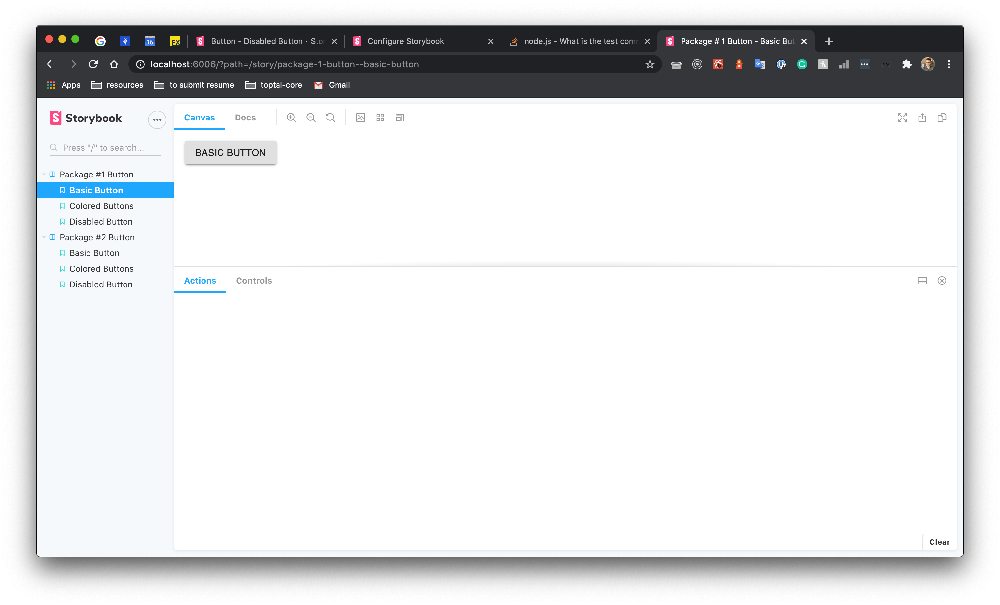

# Using the single storybook for all packages  

By modifying the .storybook/main.js as shown below, it’s possible to combine all the packages inside a single storybook bundle:

```js
module.exports = {
  "stories": [
    "../packages/**/*.stories.@(js|jsx|ts|tsx)",
  ]
}
```

## Pros:
- Easy and fast to implement.

## Cons:
- Lack of modularity, not available to start a storybook separately.
- Need to have all the modules for all packages installed to run.
- The bundle will be too heavy when there are a lot of packages.

## Screenshots

